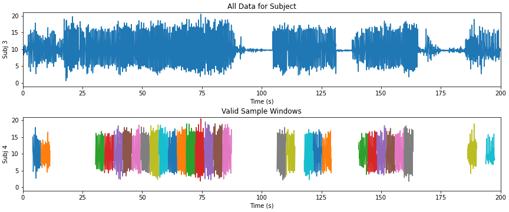
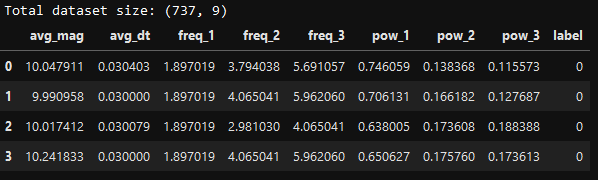
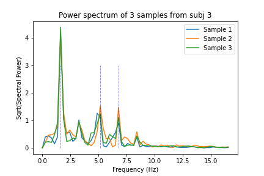
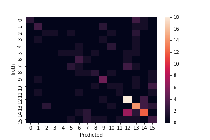

# Subject Identification via Accelerometer
Experiment to identify users via accelerometer data while walking

NOTEBOOKS:
- Classification Notebook: https://github.com/etotheipi/accelerometer_signal_proc/blob/master/subject_identification.ipynb 
- Data Exploration Notebook: https://github.com/etotheipi/accelerometer_signal_proc/blob/master/accelerometer_explore.ipynb


### Assumptions
1. We don't have to be able to identify the user at completely arbitrary times.  We can wait for them to start walking to collect a clean sample (we extract valid time windows/slices during data preprocessing/cleaning)
2. Some subjects just don't have enough data.  They have been removed (18/22 remain)
3. Intra-subject activity is modal -- walking on a flat sidewalk presents differently than walking up a grassy hill.  Need to pick classifier that accommodates modal/clustered behavior within a class (K-nearest-neighbors is good at this).

### Preprocessing & Feature Extraction
**Please see the `accelerometer_explore.ipynb` notebook for more information about preprocessing and feature extraction**

#### Top chart is original data, bottom chart is valid time slices (4 sec) used for training & testing


Features:
* Top 3 dominant frequencies in acceleartion magnitude over time sample (using FFT-based spectral density/periodogram, sorted)
* Spectral power of the 3 dominant frequencies
* Average acceleration for a user (required)
* Average time between observations for a user (required, but pointless, I already remove samples that have inconsistent sampling)



These features all have the benefit of being **rotation-invariant**.  If the phone/sensor is oriented differently in their pocket (relative to gravity), all these features will remain the same (as long as the sensitivity is consistent in each x,y,z).

I had considered adding x,y,z-specific features and rotating them so in 3D so that the average acceleration points towards -z and some other transormations to make it invariant to rotations around z-axis.  This would've been a lot of work, and I think I got a lot of discrimatory power out of the accel-magnitude data, anyway.

#### Spectral Density - Three Samples from One Subject



### Classification Approach
Due to the modal nature of the profiles, we use a K-Nearest-Neighbors algorithm, which has the benefit of not trying to reduce each class/subject to a single, average "profile".  As long as the unseen input matches one of the modes we observed during training, we have a chance to classify it correctly.

### Results

Results are solid for having 18 classes.  **Overall accuracy is 45%, with mast classes achieving >33% F1-score.**

From the `sklearn.metrics.classification_report` method:
```
              precision    recall  f1-score   support

           0       1.00      0.33      0.50         6
           3       0.50      0.43      0.46         7
           5       0.33      0.17      0.22         6
           6       0.00      0.00      0.00         3
           7       0.00      0.00      0.00         4
           8       0.20      0.17      0.18         6
           9       0.33      0.60      0.43         5
          10       0.00      0.00      0.00         7
          11       0.40      0.33      0.36         6
          12       0.50      0.62      0.56         8
          13       0.17      0.14      0.15         7
          14       0.33      0.25      0.29         4
          16       0.58      0.82      0.68        22
          17       0.48      0.64      0.55        22
          19       0.60      0.50      0.55        24
          21       0.27      0.27      0.27        11

    accuracy                           0.45       148
   macro avg       0.36      0.33      0.32       148
weighted avg       0.43      0.45      0.42       148
```

The confusion matrix isn't all that exciting but I'm obliged to include it.




### Caveats

* Using default distance metric (L2) of KNN classifier doesn't make a lot of sense for the frequency/power data.  In the interest of time, I decided it's "close enough".  In a further experiment I might consider actually comparing spectral densities directly, perhaps with some thing like KL divergence (but something that doesn't expect probability densities)
* Hand-tuned everything and pushed something that gave reasonable numbers.  As always, results are sensitive to parameterization, and I could probably even do better with a hyperparameter search.
* I should've done k-fold cross-validation...
