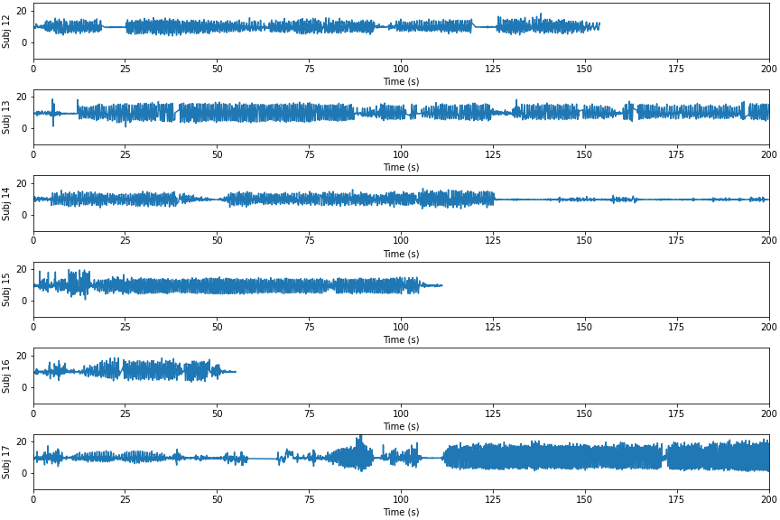
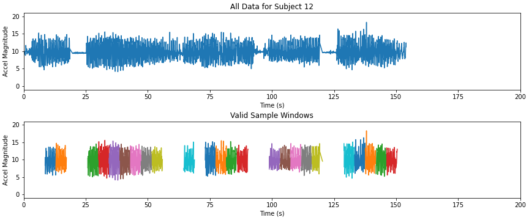

# Subject Identification via Accelerometer
Experiment to identify users via accelerometer data while walking

NOTEBOOKS:
- Acceleration Magnitude-Only Classification
  - https://github.com/etotheipi/accelerometer_signal_proc/blob/master/accel_magnitude_training.ipynb
  - Tested different KL-divergence distance methods for KNN
  - Did Bayesian Optimization for hyperparameter search (based on Gaussian Processes)
- Acceleration XYZ Classification
  - https://github.com/etotheipi/accelerometer_signal_proc/blob/master/accel_3d_training.ipynb
  - Added spherical lat/long features that are rotation invariant. 
- Data Exploration Notebook: https://github.com/etotheipi/accelerometer_signal_proc/blob/master/accelerometer_explore.ipynb


### Assumptions
1. We don't have to be able to identify the user at completely arbitrary times.  We can wait for them to start walking to collect a clean sample (we extract valid time windows/slices during data preprocessing/cleaning)
2. Some subjects just don't have enough data.  They have been removed (16/22 remain)
3. Intra-subject activity is modal -- walking on a flat sidewalk presents differently than walking up a grassy hill.  Need to pick classifier that accommodates modal/clustered behavior within a class (K-nearest-neighbors is good at this).


### Dataset Sample



### Preprocessing & Feature Extraction
**Please see the `accel_magnitude_training.ipynb` notebook for more information about preprocessing and feature extraction**

#### Top chart is original data, bottom chart is valid time slices (4 sec) used for training & testing


Features:
* **Experiment 1:** Periodogram (spectral density) of acceleration magnitude (size is dependent on the chosen time window size and resampling rate)
* **Experiment 2:** Periodograms of rotation-invariant 3D features.  
  1. Periodogram of magnitude (same as in experiment 1)
  2. First-order difference of _latitude_ on unit sphere after rotation to align with gravity
  3. First-order difference of _longitude_ on unit sphere after rotation to align with gravity
  
These features all have the benefit of being **rotation-invariant**.  If the phone/sensor is oriented differently in their pocket (relative to gravity), all these features will remain the same (as long as the sensitivity is consistent in each x,y,z).

Experiment #2 is pretty much identical in structure to experiment #1, producing a dataset the same way (using accel magnitude for selection criteria).  The only difference is that we end up with 3 periodograms concatenated together, instead of one.  The KNN algorithm is the same.

#### Spectral Density - Three Samples from One Subject


### Classification Approach
Due to the modal nature of the profiles, we use a K-Nearest-Neighbors algorithm, which has the benefit of not trying to reduce each class/subject to a single, average "profile".  As long as the unseen input matches one of the modes we observed during training, we have a chance to classify it correctly.

### Results:  Experiment #1
Results are solid for having 16 classes.  **Overall accuracy is 60%, with most classes achieving >40% F1-score.**

From the `sklearn.metrics.classification_report` method:
```
              precision    recall  f1-score   support

           0       0.77      0.92      0.84        26
           3       0.50      0.52      0.51        29
           5       0.65      0.41      0.50        27
           6       0.30      0.18      0.22        17
           7       0.20      0.15      0.17        13
           8       0.43      0.44      0.44        27
           9       0.43      0.47      0.45        19
          10       0.54      0.66      0.59        32
          11       0.21      0.27      0.24        22
          12       0.57      0.57      0.57        30
          13       0.40      0.21      0.27        29
          14       0.88      0.78      0.82        18
          16       0.77      0.78      0.77        90
          17       0.55      0.58      0.57        89
          19       0.73      0.80      0.76       103
          21       0.71      0.68      0.70        44

    accuracy                           0.61       615
   macro avg       0.54      0.53      0.53       615
weighted avg       0.60      0.61      0.60       615
```


