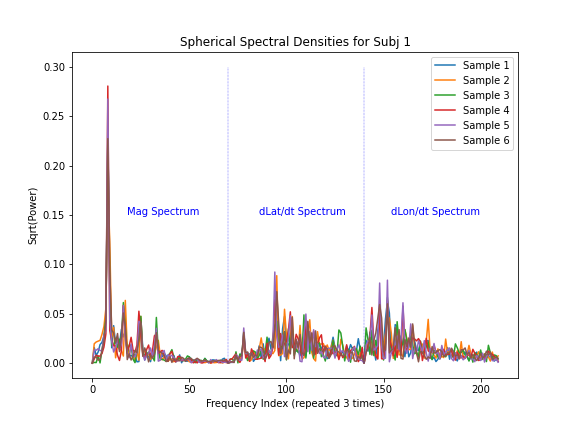

# Subject Identification via Accelerometer
Experiment to identify walking users via accelerometer in their pocket.  Dataset used:

* https://archive.ics.uci.edu/ml/datasets/Activity+Recognition+from+Single+Chest-Mounted+Accelerometer

```
Casale, P. Pujol, O. and Radeva, P.
'Personalization and user verification in wearable systems using biometric walking patterns'
Personal and Ubiquitous Computing, 16(5), 563-580, 2012
```

NOTEBOOKS:
- Experiment #1: Magnitude-Only Classification (61% accuracy)
  - https://github.com/etotheipi/accelerometer_signal_proc/blob/master/accel_magnitude_training.ipynb
  - Tested different KL-divergence distance methods for KNN
  - Did Bayesian Optimization for hyperparameter search (based on Gaussian Processes)
- Experiment #2: 3D Features Classification (71% accuracy)
  - https://github.com/etotheipi/accelerometer_signal_proc/blob/master/accel_3d_training.ipynb
  - Added spherical lat/long features that are rotation invariant. 
- Data Exploration Notebook: https://github.com/etotheipi/accelerometer_signal_proc/blob/master/accelerometer_explore.ipynb


### Assumptions
1. We don't have to be able to identify the user at completely arbitrary times.  We can wait for them to start walking to collect a clean sample (we extract valid time windows/slices during data preprocessing/cleaning)
2. Some subjects just don't have enough data.  They have been removed (16/22 remain)
3. Intra-subject activity is modal -- walking on a flat sidewalk presents differently than walking up a grassy hill.  Need to pick classifier that accommodates modal/clustered behavior within a class (K-nearest-neighbors is good at this).


### Dataset Sample


### Preprocessing & Feature Extraction

##### Example Time Window Extraction
Top chart is original data, bottom chart is valid time slices (4 sec) used for training & testing


Features:
* **Experiment 1:** Periodogram/Spectral density of acceleration magnitude only
  1. Periodogram of acceleration magnitude
* **Experiment 2:** Periodograms of rotation-invariant 3D features.  
  1. Periodogram of magnitude (same as in experiment 1)
  2. First-order difference of _latitude_ on unit sphere after rotation to align with gravity
  3. First-order difference of _longitude_ on unit sphere after rotation to align with gravity
  
All features were designed to be **rotation-invariant**.  If the phone/sensor is oriented differently in their pocket (relative to gravity), all these features **should** remain the same, as long as the sensitivity is consistent in each x,y,z.

Experiment #2 is pretty much identical in structure to experiment #1, using the accel magnitude to select the same time windows.  The only difference is that we end up with 3 periodograms concatenated together, instead of one.  The KNN algorithm is the same.

#### Experiment #1: Spectral Density - Three Samples from each of three subjects


#### Experiment #2: Spectral Density - Six Samples from One Subject


### Classification Approach
As previously mentioned, the data is modal.  Each subject/class has multiple clusters in the feature space, corresponding to walking on different terrain types.  Many classification algorithms will effectively try to reduce each class to a single, average "profile."  This may not work for this application.  

Therefore, we use a K-Nearest-Neighbors algorithm (with K=1, since many classes have very few little data).  As long as the previously-unseen input matches one of the modes we observed during training, we have a chance to classify it correctly.

### Results:  Experiment #1
Results are solid for having 16 classes.  **Overall accuracy is 61%, with most classes achieving >40% F1-score.**

From the `sklearn.metrics.classification_report` method:
```
              precision    recall  f1-score   support

           0       0.77      0.92      0.84        26
           3       0.50      0.52      0.51        29
           5       0.65      0.41      0.50        27
           6       0.30      0.18      0.22        17
           7       0.20      0.15      0.17        13
           8       0.43      0.44      0.44        27
           9       0.43      0.47      0.45        19
          10       0.54      0.66      0.59        32
          11       0.21      0.27      0.24        22
          12       0.57      0.57      0.57        30
          13       0.40      0.21      0.27        29
          14       0.88      0.78      0.82        18
          16       0.77      0.78      0.77        90
          17       0.55      0.58      0.57        89
          19       0.73      0.80      0.76       103
          21       0.71      0.68      0.70        44

    accuracy                           0.61       615
   macro avg       0.54      0.53      0.53       615
weighted avg       0.60      0.61      0.60       615
```


### Results:  Experiment #2

Adding the lat/lon sequences got us an extra 10% overall accuracy, and an even larger boost in unweighted average, indicating more consistent performance across all classes (unweighted avg went from 53% -> 66%).
```
              precision    recall  f1-score   support

           0       0.86      0.96      0.91        26
           3       0.74      0.59      0.65        29
           5       0.65      0.74      0.69        27
           6       0.57      0.24      0.33        17
           7       0.50      0.38      0.43        13
           8       0.59      0.63      0.61        27
           9       0.67      0.63      0.65        19
          10       0.64      0.72      0.68        32
          11       0.45      0.45      0.45        22
          12       0.81      0.70      0.75        30
          13       0.63      0.41      0.50        29
          14       0.84      0.89      0.86        18
          16       0.79      0.81      0.80        90
          17       0.79      0.73      0.76        86
          19       0.69      0.82      0.75       103
          21       0.65      0.73      0.69        44

    accuracy                           0.71       612
   macro avg       0.68      0.65      0.66       612
weighted avg       0.71      0.71      0.70       612
```


